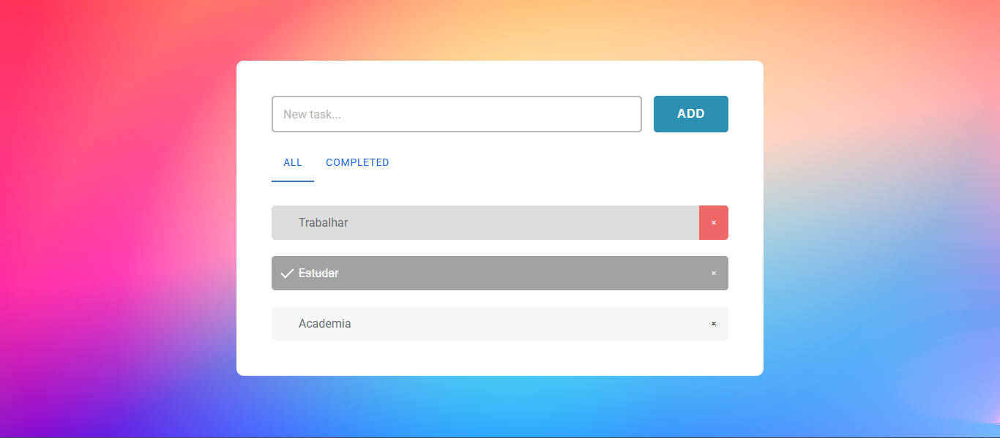

# ✅ ToDo List

Projeto de lista de tarefas (ToDo List) desenvolvido como exercício prático para reforçar conceitos de JavaScript, manipulação de DOM e eventos.

## 🧠 Descrição

Este aplicativo permite ao usuário adicionar, remover, filtrar e marcar tarefas como concluídas. A interface é simples e direta, com foco em usabilidade e experiência do usuário.

## ✨ Funcionalidades

- Adicionar nova tarefa
- Marcar tarefas como concluídas
- Remover tarefas da lista
- Filtrar por:
  - Todas
  - Concluídas
- Interface responsiva

## 🛠 Tecnologias utilizadas

- HTML5
- CSS3
- JavaScript

## 🎯 Aprendizados

- Manipulação de DOM
- Eventos (`click`, `submit`)
- Uso de `classList` para estilização dinâmica
- Filtragem de elementos com `classList.contains`
- Organização de funções JavaScript

## 🌐 Acesse o projeto online

🔗 [Clique aqui para visualizar](https://kauasilvandrade.github.io/todolist /)

## 📸 Imagem do projeto

## 📌 Status do projeto

✅ Projeto finalizado e publicado.

## ✍️ Autor

**Kauã da Silva Andrade**  
[LinkedIn](https://www.linkedin.com/in/kauã-andrade-6440a9225)  
[GitHub](https://github.com/kauasilvandrade)